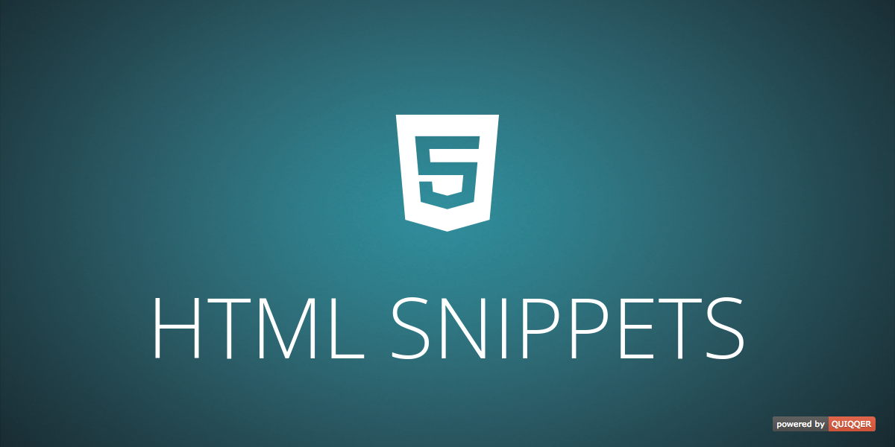

# QUIQQER HTML Snippets



The HTML Snippets module in QUIQQER allows you to quickly and efficiently insert HTML snippets (small HTML code
snippets) in specific places on your website. This module is particularly useful if you want to integrate third-party
code.

Package:

    quiqqer/html-snippets

Features
--------

- Simple insertion of HTML snippets: Allows you to quickly and efficiently add small HTML code sections at specific
  points on the website.
- Integration of third-party codes: Ideal for integrating third-party codes, such as analytics tools or advertising
  scripts.
- Integration with the GDPR module: If the GDPR module is installed, a privacy category can be assigned to each snippet
  to control the display of the snippet based on the user's privacy settings.

Installation
------------

Install the package with Composer:

```shell
./console composer require quiqqer/html-snippets
```

Configuration
-------------

Open the project settings in the QUIQQER administration and select **HTML Snippets**. Each snippet has a unique name,
a QUIQQER template event, its HTML content, an active state, and an optional GDPR category.

Usage
-----

Create a snippet, select the template event where it should be inserted, enter the HTML, and activate it. When the
optional `quiqqer/gdpr` package is installed and a GDPR category is selected, the snippet is inserted only after the
corresponding consent is available.

Contribution
----------

- Issue Tracker: https://dev.quiqqer.com/quiqqer/html-snippets/issues
- Source Code: https://dev.quiqqer.com/quiqqer/html-snippets

Support
-------

If you have found an error or want improvements, please send an e-mail to support@pcsg.de.

License
-------

- PCSG QL-1.0
- CC BY-NC-SA 4.0
